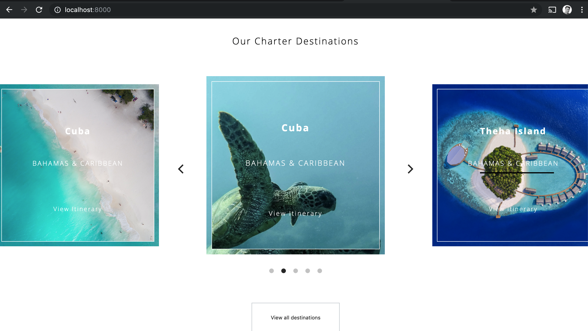

## Download and Installation

* Fork or Clone: https://Nawal00@bitbucket.org/Nawal00/mof-code-exercise.git
* Install packages: yarn
* To run webpack/localhost: yarn run serve

## Technologies used

* React
* SASS
* Webpack
* Yarn
* React Flickity - plugin

## Process

* I took considerable amount of time to understand the scale the project and work out the best suited tools for the task. This led me to write the code exercise on React with Flickity plugin for carousel and SASS for styling.

* I researched into using Flickity and downloaded it via NPM. One of the **challenges** was to figure out how to work with Flickity's react component as it didn't provide react docs/support. After a lot of iterations, I was able to get the sliders displayed on the page. From here on, I styled the slider according to the sketch design which was also the most enjoyable part of the exercise.

## Outcome - Responsive Screen Shot

###### Mobile

###### Tablet

###### Desktop

